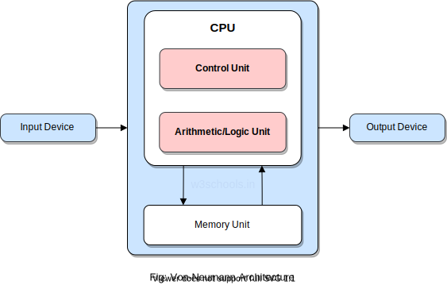

# CMPSC 200 Fall 2022: MidTerm Preparatory Sheet
____________________________________________________________________________
#### Thurday, 10/20/2022 [during lab time]

This document is not a study guide, instead, it is a sheet that lists the topics covered in the exam and at a high level highlights what to expect in the exam.

It is highly recommended that each student makes their study guide incorporate bullet points to help prepare for the exam based on your class notes, slides, coding exercises, and textbook. A customized study guide preparation will help a learner to become better. Schedule office hours to go over any topics and/or clarify questions from class discussions with the Professor. 
The topics covered in the exam are displayed below:

## Study Topic 1

---
1. Review the basic underlying computer architecture in Week 1. Review the different units of binary such as bits, bytes, words, megabytes, and gigabytes.
    - basic underlying computer architecture:
        - Both instruction and data are stored and processed in binary form inside a computer.
        - 
    - reviewing the different units of binary:
        - Binary = 0’s and 1’s
        - 2 Bit - the basic unit of information for computers. Can hold 0 or 1 values.
        - 3 Byte - equivalent to 8 bits. Each character in keyboard is stored as 1 Byte. Example: A = 01000001
        - 4 Word - equivalent to 4 bytes. Half word is 2 bytes. This depends on processors.
        - 1 bit = 0 or 1 (b)
        - 2 8 bits = 1 byte (B)
        - 3 1000 bytes = 1 kilobyte (KB)
        - 4 1 million bytes = 1 megabyte (MB)
        - 5 1 billion bytes = 1 gigabyte (GB)
        - 6 1 trillion bytes = 1 terabyte (TB)
  
2. Review how binary numbers are generated.
    - binary numbers are generated by utilizing a truth table, which varies depending on how many bits you are solving for. (2^(x)-1), where x is the number of bits, is how you determine the decimal number for the truth table. Then you can start creating the truth table to find the binary numbers.
        - 4-bit = 2^(4) = 16 -1 = 15 decimals. 4-bit truth table below:
        ```md
        | i=3 | i=2 | i=1 | i=0 | Decimal |
        |-----|-----|-----|-----|---------|
        | 0   | 0   | 0   | 0   | 0       |
        | 0   | 0   | 0   | 1   | 1       |
        | 0   | 0   | 1   | 0   | 2       |
        | 0   | 0   | 1   | 1   | 3       |
        | 0   | 1   | 0   | 0   | 4       |
        | 0   | 1   | 0   | 1   | 5       |
        | 0   | 1   | 1   | 0   | 6       |
        | 0   | 1   | 1   | 1   | 7       |
        | 1   | 0   | 0   | 0   | 8       |
        | 1   | 0   | 0   | 1   | 9       |
        | 1   | 0   | 1   | 0   | 10      |
        | 1   | 0   | 1   | 1   | 11      |
        | 1   | 1   | 0   | 0   | 12      |
        | 1   | 1   | 0   | 1   | 13      |
        | 1   | 1   | 1   | 0   | 14      |
        | 1   | 1   | 1   | 1   | 15      |
        ```
        - binary number 1111 is decimal number 15, according to the truth table.
3. Review binary match table formalization(s) and your code files from Labs. 
4. Review the logic behind the translation of the text to decimals and decimals to binary in C programming. (ASCII translation). 
5. Review the C programs discussed in class. Take a look at your lab code files. (It is important to review and be comfortable with all the source code files, 
to trace code segments in the test.)
---

## Study Topic 2

---
1. Review arrays and pointers. 
2. For example: What are the operators used to declare a pointer and how is it different from a regular variable? 
3. Are arrays homogenous or heterogeneous? How about structs? 
4. How are structs different from Arrays? The basic definitions were discussed in Weeks 2 and 3. 
5. Review the extreme programming sessions in class. 
6. Review pass-by-reference and pass-by-value programs. 
7. Review your Lab code files and be ready to trace the code and find the output of programs that utilize Pointers. 
---

## Study Topic 3

---
1. Review Variable Length Arrays, 2 Dimensional Arrays (eye. c), Dynamic Arrays, and Structs. 
2. What are the differences between Static and Dynamic arrays? 
3. What keyword do we use to work with memory in Heap? 
4. Which external library do we need to use to implement dynamic memory in C? 
5. What is Struct and how do we use structs? 
6. What is the difference between the dot (.) and arrow -> operators? 
7. How do we identify the min and max values and indices inside an array and/or an array of structs? 
8. How do we identify the top k candidates in an array? Review the logic used in the FBI, patients, and songs program in lab submissions. 
---

## Study Topic 4

---
1. Review the basic performance assessment metrics discussed in Week5. Take a look at the different examples that we did in class. 
2. Review the advanced performance assessment metrics discussed in Week5. Take a look at the different examples that we did in class and the lab sheets. 
3. Review all examples.
---

## Study Topic 5

---
1. Review the data format conversions (between decimal, binary, and hex) discussed in Week 6. Take a look at the different examples that we did in class.
2. Review how fractions are converted internally into different representations. Take a look at the different examples that we did in class.
3. Review Binary Add, Subtract, Signed Binary using (signed magnitude, one's, and two's complement), Binary Shift, Multiply, and Divide discussed in Weeks 7-8. Take a look at the different examples that we did in class.
---

#### Disclaimer

Typically, the questions are expected to be multiple-choice and descriptive/narrative questions. 
You can expect between 10  to 15 questions, with a 1 hour 50 mins exam time. 
